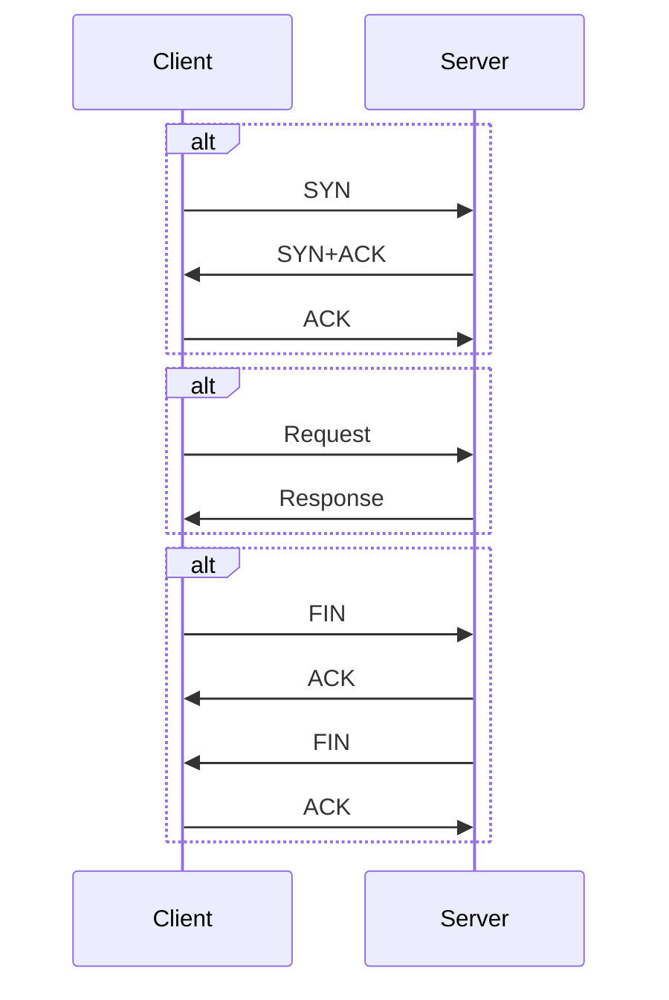

# Login

-   Login 핵심 기능

-   HTTP 특징
-   TCP
-   비연결성
-   PORT

# HTTP 흐름



# Request Header

`쿠키`
set-cookie
쿠키허용

http 문제점인 비연결성을
연결성처럼 하기위해서 사용하는것이 쿠키

# Cookie

생성을 해보는 시간을 가져봐야해요.
`express` 쿠키를 만들어보기

쿠키를 생성한다..?
쿠키를 저장한다..?

쿠키는 브라우저에 저장된다
쿠키는 클라이언트에 저장된다

`로컬스토리지`

name=ingoo; asdf=123123

name=ingoo; asdf=1234123

브라우저는 요청할떄마다 본인이 가지고있는 쿠키를
요청해더에 담아서 보낸다.

서버는 응답해더에 `Set-Cookie` 라는 이름으로 내용을만들어서 던질수있다.
그 답을 받은 브라우저는 Set-Cookie 라는 이름을 가진 `Value` 을
본인 브라우저에 데이터를 저장합니다.

```
npm install cookie-parser
```

## 암호화

암호화

-   단방향 암호화
-   양방향 암호화
